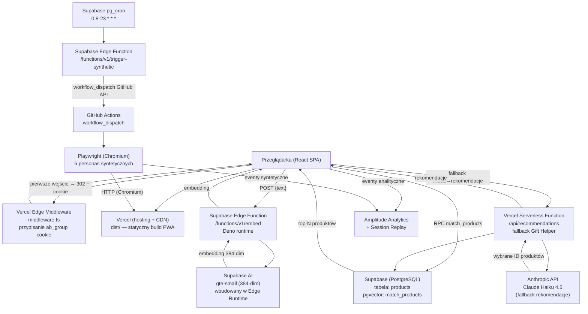

# Architektura systemu — Italica

## Przegląd systemu

Italica to demostracyjny sklep e-commerce z bielizną luksusową (marka *Linea*), zbudowany jako platforma do przeprowadzenia testu A/B. Hipoteza badawcza: użytkownicy, którym zaproponuje się wybór nastroju (Grupa B — Gift Helper), dotrą do pierwszego produktu szybciej niż ci, którzy samodzielnie wpisują zapytanie (Grupa A — wyszukiwanie semantyczne). Cały frontend działa jako Single Page Application (PWA) hostowane na Vercel. Dane produktowe przechowywane są w Supabase (PostgreSQL + pgvector), a analityka i sesje rejestrowane są w Amplitude. Ruch syntetyczny generują persony Playwright uruchamiane co godzinę przez GitHub Actions, triggerowane przez Supabase pg_cron (GitHub Actions scheduler był zawodny).

---

## Diagram architektury



---

## Komponenty

| Komponent | Plik / ścieżka | Technologia | Odpowiedzialność |
|---|---|---|---|
| **SPA Frontend** | `src/` | React 18 + TypeScript + Vite, Tailwind, shadcn/ui | Renderowanie UI, routing, stan koszyka |
| **Router** | `src/App.tsx` | react-router-dom v6 | Mapowanie URL na strony (12 ścieżek) |
| **A/B Middleware** | `middleware.ts` | Vercel Edge Runtime (Web API) | Losowe przypisanie `ab_group` (A/B 50/50) przez cookie; ważność 30 dni |
| **Feature Flag** | `src/lib/featureFlags.ts` | env var `VITE_FF_AB_TESTS` | Globalny wyłącznik logiki A/B; gdy `false`, wszyscy w grupie A |
| **Hook A/B** | `src/hooks/useABGroup.ts` | React state (cookie read) | Odczyt grupy z cookie `ab_group` na poziomie komponentu |
| **Semantic Search** | `src/hooks/useSemanticSearch.ts` | TanStack Query, fetch | Debounce 400 ms → Edge Function → `match_products` RPC; min 3 znaki |
| **Gift Helper (primary)** | `src/lib/anthropic.ts` | fetch, Supabase RPC | Nastrój → polskie zapytanie tekstowe → embed → `match_products`; top 3 |
| **Gift Helper UI** | `src/components/GiftHelper.tsx` | React | Wybór nastroju (sleepy/sexy/daily) → karty rekomendacji |
| **API Recommendations** | `api/recommendations.ts` | Vercel Serverless, `@vercel/node` | Fallback: Anthropic Claude Haiku wybiera produkty z tabeli wg nastroju; rate limit 10 req/IP/godz. |
| **Edge Function embed** | `supabase/functions/embed/index.ts` | Deno, Supabase AI | Przyjmuje tekst → `Supabase.ai.Session('gte-small')` → wektor 384-dim |
| **Edge Function trigger-synthetic** | `supabase/functions/trigger-synthetic/index.ts` | Deno | Wywołana przez pg_cron; sprawdza `CRON_SECRET`, triggeruje `workflow_dispatch` na GitHub API |
| **Supabase Client** | `src/lib/supabase.ts` | `@supabase/supabase-js` | Singleton klienta; publishable key, tylko operacje dozwolone przez RLS |
| **Produkty hook** | `src/hooks/useProducts.ts` | TanStack Query | Lista produktów + paginacja (24/strona) wg kategorii |
| **Koszyk** | `src/context/CartContext.tsx` | React Context, localStorage | Stan koszyka; reset przy nowej sesji (sessionStorage sentinel) |
| **Amplitude** | `src/lib/amplitude.ts` | `@amplitude/analytics-browser`, Session Replay plugin | Inicjalizacja, identyfikacja grupy A/B, 12 nazwanych eventów |
| **Skrypt seed** | `scripts/seed-products.ts` | tsx, Supabase SDK | Import produktów z datasetu Kaggle przez Claude Batch API → Supabase |
| **Skrypt embeddings** | `scripts/generate-embeddings.ts` | tsx, fetch | Dla każdego produktu bez wektora: concat pól → Edge Function → UPDATE |
| **Persony Playwright** | `scripts/playwright/` | Playwright, ts-node | 5 person, 2–3 per uruchomienie, ważone wg ruchu; symulacja pełnego flow |
| **GitHub Actions** | `.github/workflows/synthetic-users.yml` | GitHub Actions cron | Trigger: co godzinę 08–23 UTC (+ `workflow_dispatch`); Node 20 |
| **n8n workflow** | `n8n/synthetic-ab-test.json` | n8n | Alternatywny orchestrator syntetycznego ruchu (Metoda 1); status: [do weryfikacji — czy aktywny] |

---

## Źródła danych

### Supabase — PostgreSQL + pgvector

Tabela `products` (schemat ustalony empirycznie z kodu):

| Kolumna | Typ | Rola |
|---|---|---|
| `id` | uuid | klucz główny |
| `name` | text | nazwa produktu |
| `category` | text | `biustonosze \| majtki \| zestawy \| piżamy` |
| `price` | numeric | cena w PLN |
| `description` | text | opis (źródło do embeddingu) |
| `image_url` | text | URL obrazka (Supabase Storage `ItalicaImages` [do weryfikacji]) |
| `color` | text\|null | kolor |
| `mood` | text[] | `sleepy \| sexy \| daily` — tablica nastrojów |
| `sku` | text\|null | numer SKU |
| `rating` | numeric\|null | ocena (backfill skryptem) |
| `family` | text\|null | rodzina/kolekcja produktu |
| `details` | jsonb\|null | lista `{label, value}` — specyfikacja |
| `reviews` | jsonb\|null | lista `{author, rating, text}` |
| `embedding` | vector(384) | wektor gte-small (384 dim); NULL przed uruchomieniem skryptu |
| `created_at` | timestamptz | czas insertu |

**Funkcja SQL `match_products`** — cosine similarity na kolumnie `embedding`, threshold 0.4, zwraca top-N produktów.

**Rozmiar danych**: ~1 000 produktów (z datasetu Kaggle, wzbogaconych przez Claude Batch API).

### localStorage / sessionStorage (przeglądarka)

| Klucz | Magazyn | Zawartość |
|---|---|---|
| `italica-cart` | localStorage | Koszyk (serializowany JSON) |
| `italica-session` | sessionStorage | Sentinel nowej sesji; reset koszyka przy nowym oknie |
| `ab_group` | Cookie | `A` lub `B`; Max-Age 30 dni; SameSite=Lax |

---

## Integracje i połączenia

| Integracja | Kierunek | Uwierzytelnianie | Uwagi |
|---|---|---|---|
| **Supabase REST API** | Frontend → Supabase | Publishable key (`VITE_SUPABASE_PUBLISHABLE_KEY`); RLS po stronie DB | Odczyt produktów, RPC `match_products` |
| **Supabase Edge Function `/embed`** | Frontend → Supabase | Bearer publishable key | Przekształcanie tekstu w wektor 384-dim |
| **Supabase** (skrypty) | Lokalny skrypt → Supabase | Secret key (`VITE_SUPABASE_SECRET_KEY`) — TYLKO lokalnie, nie w bundlu | Seed, embeddingi |
| **Anthropic API** | Vercel API Route → Anthropic | `ANTHROPIC_API_KEY` (env Vercel, nigdy w kliencie) | Fallback rekomendacje Gift Helper; model: `claude-haiku-4-5-20251001` |
| **Amplitude Analytics** | Frontend → Amplitude | `VITE_AMPLITUDE_API_KEY` (publiczny, w bundlu) | Eventy + Session Replay (100% próbkowanie, maska conservative) |
| **Supabase pg_cron → Edge Function** | Supabase (wewnętrzny) → Supabase Edge | `CRON_SECRET` w nagłówku `x-cron-secret` | Harmonogram 0 8-23 * * *; triggeruje `trigger-synthetic` |
| **Edge Function → GitHub API** | Supabase Edge → GitHub | `GITHUB_TOKEN` (PAT, scope: workflow) | `POST /repos/.../actions/workflows/synthetic-users.yml/dispatches` |
| **GitHub Actions → Vercel** | GHA → Vercel | `VERCEL_BYPASS_SECRET` (GH secret) w nagłówku HTTP | Playwright omija deployment protection |
| **GitHub Actions → Amplitude** | Playwright (GHA) → Amplitude | Jak frontend (klucz zawarty w apce) | Syntetyczne eventy A/B |

---

## Przepływ danych

### Ścieżka A — wyszukiwanie semantyczne

```
Użytkownik wpisuje zapytanie (≥3 znaki)
  → 400 ms debounce (useSemanticSearch)
  → POST /functions/v1/embed  {text: zapytanie}
    → gte-small (Supabase AI) → wektor 384-dim
  ← {embedding: number[384]}
  → Supabase RPC match_products(embedding, threshold=0.4, count=8)
  ← top 8 produktów (cosine similarity)
  → wyświetlenie wyników + trackSearchQueryEntered(query, count)
  → kliknięcie produktu → trackProductViewed + trackTimeToFirstProduct
```

### Ścieżka B — Gift Helper

```
Użytkownik klika ikonę Gift Helper
  → strona /gift-helper (Grupa B)
  → wybór nastroju (sleepy / sexy / daily)
    → trackGiftHelperMoodClick(mood)
  → lib/anthropic.ts: nastrój → polskie zapytanie tekstowe
  → POST /functions/v1/embed  {text: zapytanie PL}
    → gte-small → wektor 384-dim
  → Supabase RPC match_products(embedding, threshold=0.4, count=6) → top 3
  ← [w razie błędu sieciowego fallback 1: filtr mood w tabeli products]
  ← [w razie błędu fallback 2: POST /api/recommendations → Claude Haiku → wybór ID]
  → wyświetlenie rekomendacji + trackGiftHelperRecommendation
  → kliknięcie produktu → trackProductViewed + trackTimeToFirstProduct
```

### Przepływ analityczny (oba warianty)

```
Każde zdarzenie → Amplitude.track(eventName, {ab_group, ...props})
                → Amplitude Session Replay (nagranie kliku/scrolla)
Identyfikacja grupy A/B → Amplitude.identify({ab_group}) przy inicjalizacji
```

### Syntetyczny ruch testowy

```
Supabase pg_cron (co godzinę, 08–23 UTC)
  → net.http_post → /functions/v1/trigger-synthetic (x-cron-secret)
    → GitHub API workflow_dispatch → synthetic-users.yml
      → GitHub Actions runner (ubuntu-latest)
        → checkout repo → npm install → install Playwright Chromium (cache)
        → npx ts-node run-personas.ts
    → losowanie 2–3 person z ważonej puli
    → każda persona: createPersonaSession() → Chromium headless
      → HTTP do Vercel (z VERCEL_BYPASS_SECRET w nagłówku)
      → middleware przypisuje ab_group cookie
      → persona symuluje zachowanie (browse / search / gift helper / checkout)
      → Amplitude.flush() → close browser
    → 30–90 s pauzy między personami
```

---

## Routing aplikacji

| Ścieżka | Komponent | Uwagi |
|---|---|---|
| `/` | `Index` | Strona główna: hero, karuzele, edytoriale |
| `/category/:category` | `Category` | Siatka produktów; paginacja 24/str; filtr wg kategorii |
| `/product/:productId` | `ProductDetail` | Galeria, opis, szczegóły, recenzje |
| `/checkout` | `Checkout` | Formularz zamówienia (brak integracji płatności) |
| `/gift-helper` | `GiftHelperPage` | UI wyboru nastroju + rekomendacje |
| `/about/our-story` … | `OurStory` itd. | Strony informacyjne o marce |
| `/privacy-policy` | `PrivacyPolicy` | Polityka prywatności |
| `/terms-of-service` | `TermsOfService` | Regulamin |

---

## Zmienne środowiskowe

| Zmienna | Gdzie używana | Rola |
|---|---|---|
| `VITE_AMPLITUDE_API_KEY` | Frontend (bundle) | Klucz projektu Amplitude |
| `VITE_SUPABASE_URL` | Frontend + skrypty | URL projektu Supabase |
| `VITE_SUPABASE_PUBLISHABLE_KEY` | Frontend (bundle) | Publishable key Supabase (publiczny, RLS chroni dane) |
| `VITE_FF_AB_TESTS` | Frontend (bundle) | Feature flag: `"true"` włącza logikę A/B |
| `ANTHROPIC_API_KEY` | Vercel backend only | Klucz Anthropic dla `/api/recommendations` |
| `VITE_SUPABASE_SECRET_KEY` | Skrypty lokalne only | Secret key; **nigdy nie trafia do bundlu** |
| `PLAYWRIGHT_TARGET_URL` | GitHub Actions secret | URL apki dla Playwright |
| `VERCEL_BYPASS_SECRET` | GitHub Actions secret | Omija Vercel deployment protection |
| `GITHUB_TOKEN` | Supabase secret (Edge Function) | PAT GitHub, scope `workflow`; używany przez `trigger-synthetic` do wywołania `workflow_dispatch` |
| `CRON_SECRET` | Supabase secret (Edge Function) | Losowy string; weryfikuje że request do `trigger-synthetic` pochodzi z pg_cron |

---

## Hosting i deployment

| Warstwa | Platforma | Sposób uruchomienia |
|---|---|---|
| Frontend (SPA) | Vercel | `npm run build` → `dist/`; auto-deploy z brancha `main` przez GitHub |
| Edge Middleware | Vercel Edge Runtime | Zawarty w repo jako `middleware.ts`; uruchamia się na każdym requescie do nie-API |
| Serverless API | Vercel Functions | `api/recommendations.ts`; deploy razem z frontendem |
| Edge Function embed | Supabase (Deno) | `supabase/functions/embed/`; deploy przez Supabase CLI (`supabase functions deploy embed`) |
| Baza danych | Supabase (managed PostgreSQL) | Managed service; bez samodzielnego hostingu |
| Syntetyczny testing — trigger | Supabase pg_cron + Edge Function | `cron.schedule('trigger-synthetic-hourly', '0 8-23 * * *', ...)`; wywołuje GitHub API |
| Syntetyczny testing — runner | GitHub Actions | `workflow_dispatch` (trigger z Supabase); runner `ubuntu-latest`; timeout 15 min |
| n8n (Metoda 1) | [do weryfikacji] | Workflow w `n8n/synthetic-ab-test.json`; trigger co 10 min wg pliku |

---

## Otwarte pytania / TODO

- **n8n status**: plik `n8n/synthetic-ab-test.json` istnieje i konfiguruje trigger co 10 minut, ale nie wiadomo czy workflow jest aktualnie aktywny na żadnym serwerze n8n — [do weryfikacji].
- **Supabase Storage**: w kodzie są referencje do URL-i obrazków w `image_url`, ale bucket `ItalicaImages` (z memory) nie jest weryfikowany przez Edge Function ani RLS — [do weryfikacji czy bucket jest publiczny].
- **Checkout bez płatności**: `Checkout.tsx` nie integruje żadnej bramki płatniczej; `Order Completed` jest trackowane, ale zamówienie nie jest persystowane w bazie.
- **RLS**: brak widocznych polityk RLS w repozytorium (nie ma migracji SQL w repo) — polityki muszą być skonfigurowane bezpośrednio w panelu Supabase.
- **Session Replay 100%**: `sampleRate: 1` w `amplitude.ts` oznacza nagrywanie wszystkich sesji — przy wzroście ruchu może przekroczyć limity planu Amplitude.
- **VITE_FF_AB_TESTS**: nie ma tej zmiennej w `.env.example` — nowy developer nie dowie się o niej bez zagłębienia w kod.
- **Embeddingowy model `gte-small`**: nie wiadomo czy Supabase AI (`gte-small`) jest dostępny na wszystkich planach Supabase — plan projektu [do weryfikacji].
